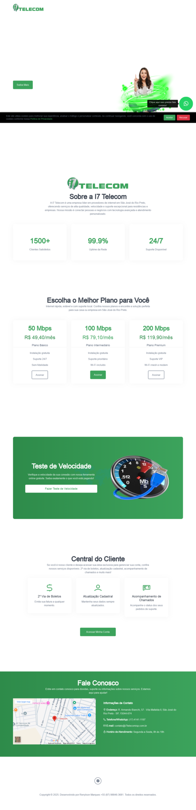

# I7 Telecom — Site Institucional

> Um site institucional responsivo e moderno para I7 Telecom, com ferramenta integrada de teste de velocidade, desenvolvido com foco em performance, responsividade e experiência do usuário.

🐳 **Execute localmente**: `docker compose up -d --build`



---

## 📋 Sobre o Projeto

Site institucional completo para I7 Telecom, apresentando informações sobre a empresa, planos de internet, contato e uma ferramenta funcional de teste de velocidade. O projeto foi desenvolvido com ênfase em **responsividade**, **performance** e **usabilidade**, utilizando containerização para fácil deploy.

### ✨ Principais Características

- ✅ **Responsivo** — otimizado para dispositivos móveis, tablets e desktops (mobile-first)
- ✅ **Teste de Velocidade** — ferramenta integrada para medir download e upload em tempo real
- ✅ **URLs Limpas** — reescrita de URLs via Nginx para melhor SEO
- ✅ **Containerização** — deploy simplificado com Docker e Nginx
- ✅ **Design Limpo e Profissional** — transmite confiança e modernidade

---

## 🛠️ Tecnologias Utilizadas

| Tecnologia | Descrição |
|-----------|-----------|
| **Docker & Docker Compose** | Containerização e orquestração para deploy |
| **Nginx** | Servidor web com reverse proxy e reescrita de URLs |
| **Node.js/Express** | Backend API para teste de velocidade |
| **HTML5/CSS3/JavaScript** | Frontend responsivo |
| **Bootstrap 4.5** | Framework CSS para layout e componentes |
| **Git** | Controle de versão |

---

## 📁 Estrutura do Projeto

```
site-i7telecom/
├── Dockerfile                 # Configuração do container principal
├── nginx.conf                 # Configuração do Nginx (servidor, proxy, rewrites)
├── supervisord.conf           # Gerenciamento de processos
├── index.html                 # Página inicial com seções da empresa
├── teste-velocidade.html      # Página dedicada ao teste de velocidade
├── assets/                    # Recursos estáticos
│   ├── css/                   # Folhas de estilo (Bootstrap, custom)
│   ├── js/                    # Scripts JavaScript (jQuery, custom)
│   ├── fonts/                 # Fontes
│   └── images/                # Imagens
└── backend/                   # API do teste de velocidade
    ├── Dockerfile             # Container do backend
    ├── package.json           # Dependências Node.js
    └── server.js              # Servidor Express com endpoints de teste
```

---

## 🎯 Funcionalidades Implementadas

### Frontend
- 📱 **Design Responsivo** — mobile-first, testado em múltiplos dispositivos
- ⚡ **Teste de Velocidade** — medição precisa de download e upload com tamanhos dinâmicos de arquivo
- 🔗 **URLs Limpas** — sem extensões .html para melhor experiência e SEO
- 🎨 **Interface Intuitiva** — navegação fácil e feedback visual durante testes

### Backend
- 🐳 **API Containerizada** — endpoints para download/upload via Express
- 📊 **Teste Adaptativo** — ajuste automático do tamanho dos arquivos para medição precisa
- 🔄 **Proxy Reverso** — Nginx roteia requisições para o backend

---

## 🚀 Como Executar

### Com Docker (Recomendado)
```bash
# Clonar o repositório
git clone https://github.com/renylson/site-i7telecom.git
cd site-i7telecom

# Build e executar
docker compose up -d --build

# Acessar em http://localhost
```

### Desenvolvimento Local
- Instale Node.js e Nginx localmente
- Execute o backend: `cd backend && npm install && node server.js`
- Configure Nginx com o nginx.conf fornecido
- Abra index.html no navegador

---

## 💡 Conceitos & Padrões Demonstrados

Este projeto demonstra:

- ✅ **Containerização** — Docker para isolamento e deploy consistente
- ✅ **Arquitetura Cliente-Servidor** — frontend estático + API backend
- ✅ **Responsividade Mobile-First** — CSS otimizado para mobile primeiro
- ✅ **Otimização de Performance** — testes assíncronos e tamanhos dinâmicos
- ✅ **Configuração de Servidor** — Nginx como proxy e reescritor de URLs
- ✅ **Código Organizado** — separação clara de frontend/backend e assets
- ✅ **DevOps Básico** — Docker Compose para orquestração

---

## 📝 Notas de Desenvolvimento

- O teste de velocidade simula downloads/uploads reais com arquivos gerados dinamicamente
- A API backend roda em container separado para isolamento
- URLs limpas são implementadas via regras de rewrite no Nginx
- O design é totalmente responsivo, priorizando experiência mobile

---

## 📞 Sobre o Desenvolvedor

**Renylson Marques** — Desenvolvedor em Formação

Background técnico em telecomunicações. Especialista em troubleshooting, automação e infraestrutura. Cursando Engenharia de Software com prática em **React**, **Python**, **Node.js**, **Docker** e **SQL**.

**Habilidades:**
- **Backend**: Python, Node.js, SQL (PostgreSQL, SQL Server)
- **Frontend**: React, Vue.js, HTML5, CSS3
- **DevOps**: Docker, Linux, CI/CD

- 🔗 **GitHub**: [github.com/renylson](https://github.com/renylson)
- 💼 **LinkedIn**: [linkedin.com/in/renylsonmarques](https://www.linkedin.com/in/renylsonmarques/)
- 📧 **Email**: renylsonm@gmail.com

---

## 📄 Licença

Este projeto foi desenvolvido como portfólio profissional para demonstrar habilidades em desenvolvimento web e DevOps.
